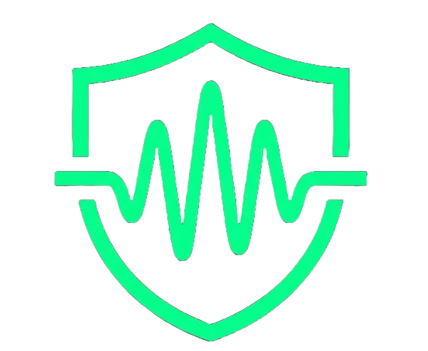

<p align="center">
  
</p>

<h1 align="center">CovertWave</h1>

<p align="center">
  <strong>Military-Grade Audio Steganography with Adaptive Energy-Weighted Embedding</strong>
</p>

<p align="center">
  
  
  
  
</p>

---

CovertWave is a full-stack audio steganography system that hides encrypted messages inside WAV audio files using a novel **energy-weighted stochastic LSB embedding** algorithm. The system achieves PSNR values exceeding **75 dB** while remaining undetectable by industry-standard steganalysis methods.

Built for the **IEEE INDISCON 2026** conference paper submission.

## Features

- **Adaptive Energy-Weighted Embedding** — Stochastically distributes payload bits into high-energy audio frames, making detection statistically infeasible
- **AES-256-GCM Encryption** — Messages are encrypted before embedding, providing military-grade confidentiality with authenticated encryption
- **Multi-bit LSB Support** — Choose between 1-bit (highest quality), 2-bit (balanced), or 4-bit (high capacity) embedding
- **Real-time Capacity Meter** — Live progress bar with color-coded security warnings (green/yellow/red)
- **Extraction Payload Map** — Dual-axis Chart.js visualization showing where encrypted fragments are hidden in the audio waveform
- **4-Method Steganalysis Battery** — Chi-Square, RS Analysis, Sample Pair Analysis, and Histogram Analysis for detection testing
- **Premium Dark UI** — Glassmorphic interface with smooth native scrolling and micro-animations

## Architecture

```
audio_steganography/
|-- adaptive.py              # Energy-weighted stochastic embedding algorithm
|-- encoder.py               # Standard randomized LSB encoder
|-- decoder.py               # Standard LSB decoder
|-- crypto.py                # AES-256-GCM encrypt/decrypt module
|-- metrics.py               # PSNR, SNR, MSE, spectral analysis
|-- steganalysis_extended.py # 4-method detection battery
|
|-- backend/
|   |-- main.py              # FastAPI server (encode/decode/analyze APIs)
|   |-- requirements.txt     # Python dependencies
|
|-- frontend/
|   |-- index.html           # Single-page app structure
|   |-- style.css            # Dark glassmorphic theme
|   |-- app.js               # UI logic, Chart.js visualizations
|   |-- logo.png             # CovertWave icon
|
|-- research_benchmark.py    # 600-point benchmark runner
|-- generate_paper_graphs.py # IEEE paper figure generator
|-- research_results_full.csv# Full benchmark dataset
|-- graphs_final/            # Generated IEEE paper figures
```

## Quick Start

### Prerequisites

- Python 3.10+
- pip

### 1. Clone the repository

```bash
git clone https://github.com/YOUR_USERNAME/CovertWave.git
cd CovertWave
```

### 2. Install dependencies

```bash
pip install -r backend/requirements.txt
```

### 3. Run the server

```bash
cd backend
python main.py
```

The app will be available at **http://localhost:8000**

### 4. Use the app

1. **Encode** — Upload a WAV file, type your secret message, set a password, and download the stego file
2. **Decode** — Upload the stego file, enter the password, and retrieve your hidden message with a visual payload map
3. **Analyze** — Run the full steganalysis battery on any WAV file to test for hidden data

## Dataset

The audio dataset (44 WAV files across 4 categories: ambient, instrumental, short_voice, speech) is not included in this repository due to its size (~235 MB). To run the benchmark, place your own `.wav` files in:

```
dataset/
|-- ambient/
|-- instrumental/
|-- short_voice/
|-- speech/
```

## Research

This project includes the full reproducible research pipeline used for the IEEE INDISCON 2026 paper:

- **`research_benchmark.py`** — Runs the complete 600-point benchmark across all audio categories, LSB configurations, and embedding algorithms
- **`research_results_full.csv`** — Raw benchmark data (600 rows x 15+ metrics)
- **`generate_paper_graphs.py`** — Generates all 5 publication-quality figures
- **`graphs_final/`** — Pre-generated figures ready for paper inclusion

### Key Results

| Metric | 1-bit LSB | 2-bit LSB | 4-bit LSB |
|---|---|---|---|
| Mean PSNR (dB) | 75.61 | 63.78 | 51.92 |
| Steganalysis Survival Rate | 100% | 95% | 40% |
| Max Capacity (chars/file) | ~27K | ~55K | ~110K |

## Tech Stack

- **Backend**: Python, FastAPI, NumPy, SciPy, PyCryptodome
- **Frontend**: Vanilla JS, CSS, Chart.js
- **Encryption**: AES-256-GCM (authenticated encryption)
- **Signal Processing**: Frame-level RMS energy analysis, spectral transparency metrics

## License

This project is part of an academic research submission. Please cite appropriately if used in academic work.
